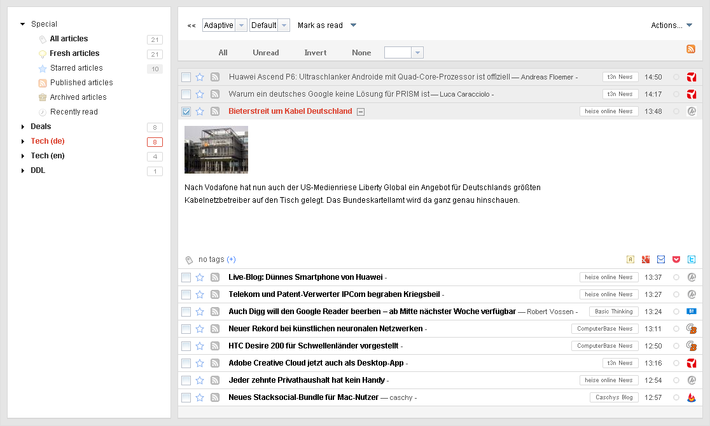
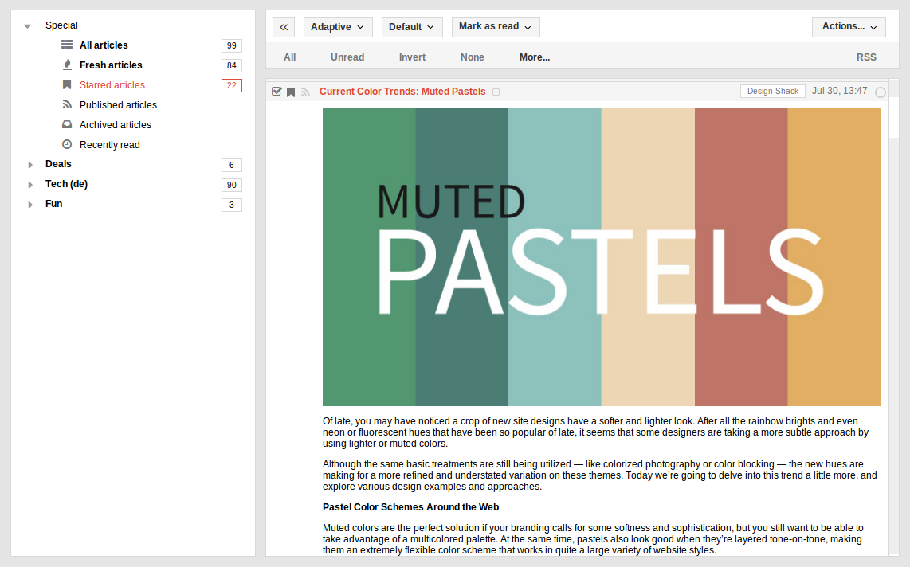
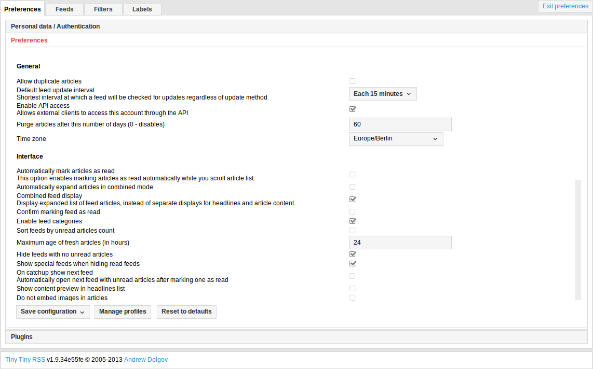
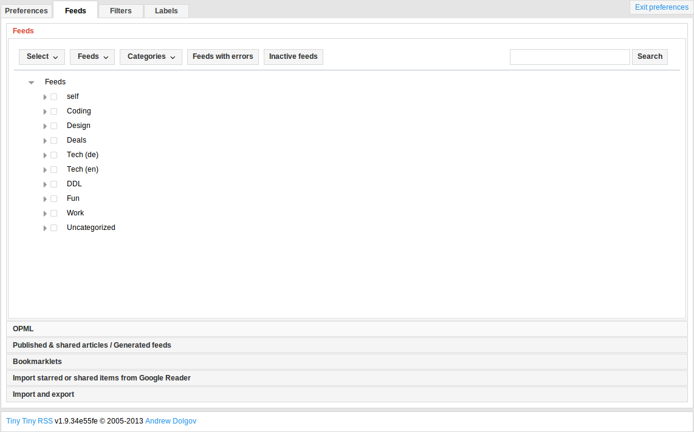

# clean-greader

clean-greader is a tiny tiny rss (1.8+) theme based on the latest Google Reader and inspired by other Google Services.  
As of 2013/08/29 the theme is build from scratch to be independent from changes to the tt-rss default.css.

## Preview


## Installation
### Using Git
```sh
$ # Assuming, that your tt-rss instance is located at /usr/share/tt-rss
$ cd /usr/share/tt-rss/themes
$ git clone https://github.com/naeramarth7/clean-greader
$ ln -s ./clean-greader/clean-greader.css ./clean-greader.css
```

### Manual
1. Download the package using the "Download ZIP" button on the right
2. Copy the clean-greader-master folder into you tt-rss/themes folder (e. g. `/usr/share/tt-rss/themes`) and rename it to clean-greader
3. Copy the clean-greader.css file from the clean-greader folder into you themes root folder (e. g. `/usr/share/tt-rss/themes`)

## Update
### Using git
```sh
$ # Assuming, that your tt-rss instance is located at /usr/share/tt-rss:
$ cd /usr/share/tt-rss/themes/clean-greader
$ git pull
```

### Manual
Same as Installation - just overwrite the files.

## Custom settings

There is a sample file called `_config.scss.sample` in the themes `css/` folder.  
Before running gulp.js tasks, make sure to create this file, since you'll get an error otherwise.

```sh
$ cd /usr/share/tt-rss/themes/clean-greader/css
$ # Either work with a copy...
$ cp _config.scss{.sample,}
$ # ... or link it, if you're fine with the default settings.
$ ln -s _config.scss{.sample,}
```

### Thumbnail for main feed image ( `$small-main-feed-image` )

- type: `boolean`
- default: `true`

Display the first image as a thumbnail to save some space.  
If you're using image feeds, this might not be what you want.

### Rebuild the main.css file

After making changes to the settings file (or basically any .scss file), you need to rebuild the css file.

```sh
$ cd /usr/share/tt-rss/themes/clean-greader
$ # Install / update the dev dependencies
$ npm install
$ # Rebuild the .css file
$ gulp sass
```

## Maintenance
As of the "build from scratch" update, the theme is completely written using [SASS/SCSS](http://sass-lang.com/). A tutorial on [Devloping With Sass and Chrome DevTools](http://net.tutsplus.com/tutorials/html-css-techniques/developing-with-sass-and-chrome-devtools/) can be found on net.tutsplus.com.

### Working with sass and gulp.js

```sh
$ cd /usr/share/tt-rss/themes/clean-greader
$ # Install / update the dev dependencies
$ npm install
$ # Run gulp as background task ...
$ gulp watch
$ # ... or let it build the .css file once
$ gulp sass
```

### Building

To prepare the .css file for a pull request, please use the `build` task. This will replace your custom configuration with the default configuration, build the .css file and put your configuration back in place.

```sh
$ gulp build
```

## Support
The clean-greader theme is build on Google Chrome (33) using Arch Linux and tested on Google Chrome (33) as well as Mozilla Firefox (23). These are the only official support browsers, so there will be no guarantee for the usability on other browsers except of those.

## Tiny Tiny RSS Settings
| Setting                                          | Value      |
|:------------------------------------------------ |:----------:|
| `Combined feed display`                          | `enabled`  |
| `Automatically expand articles in combined mode` | `disabled` |
| `Show content preview in headlines list`         | `disabled` |

## Screenshots
### Main Page


### Main Settings


### Feed Settings


---

[](https://flattr.com/submit/auto?user_id=naeramarth7&url=https://github.com/naeramarth7/clean-greader&title=clean-greader&language=&tags=github&category=software)
